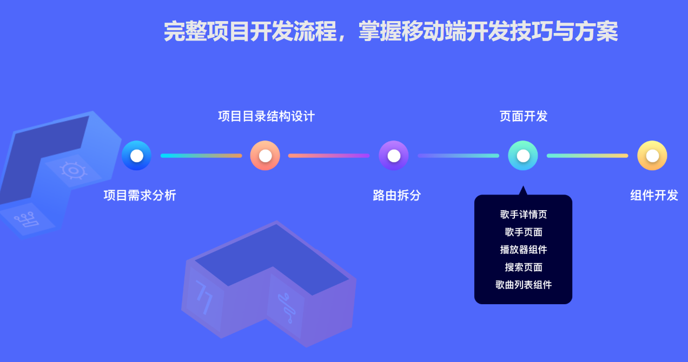
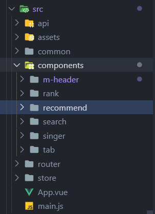
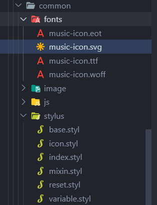
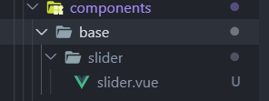
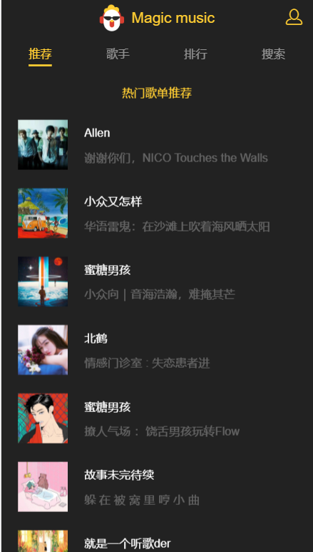
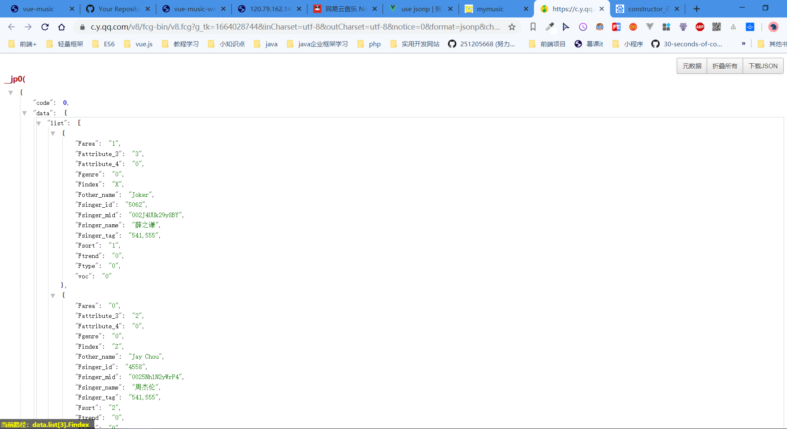
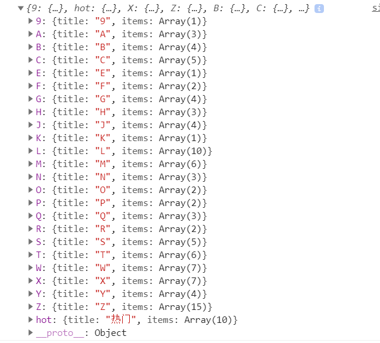
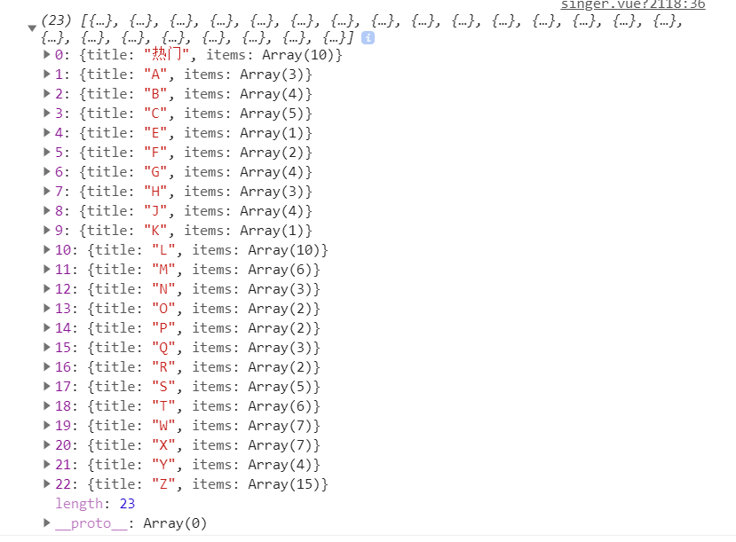
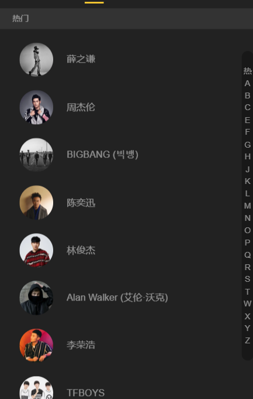

# vue全家桶开发音乐app

## 简介

[](https://github.com/vuejs/vue)
[](https://github.com/ElemeFE/element)

[项目体验](http://music.yangxiansheng.top/#/recommend)

>项目是用vuecli 2.9构建 用vuecli 3.x的用户自行重构部分代码

### 项目使用到的技术
```markdown
MVVM框架：Vue.js （版本2.x）
状态管理：Vuex
前端路由：Vue Router
服务端通讯：axios、jsonp
移动端滚动库：better-scroll
构建工具：webpack 2.0
源码：es6
```
### 项目基本目录

```
 .
├── README.md
├── build
│   ├── build.js
│   ├── check-versions.js
│   ├── dev-client.js
│   ├── dev-server.js
│   ├── utils.js
│   ├── vue-loader.conf.js
│   ├── webpack.base.conf.js
│   ├── webpack.dev.conf.js
│   └── webpack.prod.conf.js
├── config
│   ├── dev.env.js
│   ├── index.js
│   └── prod.env.js
├── index.html
├── package.json
├── prod.server.js
├── src
│   ├── App.vue
│   ├── api
│   │   ├── config.js
│   │   ├── rank.js
│   │   ├── recommend.js
│   │   ├── search.js
│   │   ├── singer.js
│   │   └── song.js
│   ├── base
│   │   ├── confirm
│   │   │   └── confirm.vue
│   │   ├── listview
│   │   │   └── listview.vue
│   │   ├── loading
│   │   │   ├── loading.gif
│   │   │   └── loading.vue
│   │   ├── no-result
│   │   │   ├── no-result.vue
│   │   │   ├── no-result@2x.png
│   │   │   └── no-result@3x.png
│   │   ├── progress-bar
│   │   │   └── progress-bar.vue
│   │   ├── progress-circle
│   │   │   └── progress-circle.vue
│   │   ├── scroll
│   │   │   └── scroll.vue
│   │   ├── search-box
│   │   │   └── search-box.vue
│   │   ├── search-list
│   │   │   └── search-list.vue
│   │   ├── slider
│   │   │   └── slider.vue
│   │   ├── song-list
│   │   │   ├── first@2x.png
│   │   │   ├── first@3x.png
│   │   │   ├── second@2x.png
│   │   │   ├── second@3x.png
│   │   │   ├── song-list.vue
│   │   │   ├── third@2x.png
│   │   │   └── third@3x.png
│   │   ├── switches
│   │   │   └── switches.vue
│   │   └── top-
│   │       └── top-.vue
│   ├── common
│   │   ├── fonts
│   │   │   ├── music-icon.eot
│   │   │   ├── music-icon.svg
│   │   │   ├── music-icon.ttf
│   │   │   └── music-icon.woff
│   │   ├── image
│   │   │   └── default.png
│   │   ├── js
│   │   │   ├── cache.js
│   │   │   ├── config.js
│   │   │   ├── dom.js
│   │   │   ├── jsonp.js
│   │   │   ├── mixin.js
│   │   │   ├── singer.js
│   │   │   ├── song.js
│   │   │   └── util.js
│   │   └── stylus
│   │       ├── base.styl
│   │       ├── icon.styl
│   │       ├── index.styl
│   │       ├── mixin.styl
│   │       ├── reset.styl
│   │       └── variable.styl
│   ├── components
│   │   ├── add-song
│   │   │   └── add-song.vue
│   │   ├── disc
│   │   │   └── disc.vue
│   │   ├── m-header
│   │   │   ├── logo@2x.png
│   │   │   ├── logo@3x.png
│   │   │   └── m-header.vue
│   │   ├── music-list
│   │   │   └── music-list.vue
│   │   ├── player
│   │   │   └── player.vue
│   │   ├── playlist
│   │   │   └── playlist.vue
│   │   ├── rank
│   │   │   └── rank.vue
│   │   ├── recommend
│   │   │   └── recommend.vue
│   │   ├── search
│   │   │   └── search.vue
│   │   ├── singer
│   │   │   └── singer.vue
│   │   ├── singer-detail
│   │   │   └── singer-detail.vue
│   │   ├── suggest
│   │   │   └── suggest.vue
│   │   ├── tab
│   │   │   └── tab.vue
│   │   ├── top-list
│   │   │   └── top-list.vue
│   │   └── user-center
│   │       └── user-center.vue
│   ├── main.js
│   ├── router
│   │   └── index.js
│   └── store
│       ├── actions.js
│       ├── getters.js
│       ├── index.js
│       ├── mutation-types.js
│       ├── mutations.js
│       └── state.js
└── static
    ├── 1.png
    ├── 2.png
    ├── 3.png
    ├── 4.png
    └── 5.png


```
### 项目开发基本流程


### 该项目包含到的基本组件库
**基础组件**
```bash
1.confirm：确认对话框组件
2.listview：通讯录列表组件
3.loading：加载态组件
4.no-result：无结果展示组件
5.progress-bar：进度条组件
6.progress-circle：圆形进度条组件
7.scroll：移动端滚动组件
8.search-box：搜索框组件
9.search-list：搜索列表组件
10.slider：轮播图组件
11.switches：开关切换组件
12.top-：顶部消息提示组件
1.  song-list：歌曲列表组件
```
**业务组件**
```bash
1.add-song：添加歌曲到列表组件
2.disc：歌单详情页组件
3.m-header：页面头部组件
4.music-list：歌曲列表页面组件
5.player：播放器内核组件
6.playlist：播放列表组件
7.rank：排行榜页面组件
8.recommend：推荐页面组件
9.search：搜索页面组件
10.singer：歌手页面组件
11.singer-detail：歌手详情页组件
12.suggest：搜索提示列表组件
13.tab：顶部导航栏组件
14.top-list：排行榜详情页组件
15.user-center：用户中心页组件
```

## 初始化项目


>再开始开发项目之前，你必须要创建项目，并且安装好开发要用的依赖 插件等


### 创建项目

- 创建项目

```bash
$ vue init webpack XXXX
```


>vuecli3 开发 vue create XXXX


### 初始化

- 设计目录结构
  
- 移动端初始化缩放

```html
<meta
  name="viewport"
  content="width=device-width,initial-scale=1.0 minimum-scale=1.0 maximum-scale=1.0 user-scalable=no"
/>
```

- 初始化样式 并且写好项目要用到的**icon 样式** 全局样式 背景图调用样式 等
  >  样式和字体图标的 svg 文件建议放在 common 里面

  
  <br>
  reset.styl

```stylus
/**
 * Eric Meyer's Reset CSS v2.0 (http://meyerweb.com/eric/tools/css/reset/)
 * http://cssreset.com
 */
html, body, div, span, applet, object, iframe,
h1, h2, h3, h4, h5, h6, p, blockquote, pre,
a, abbr, acronym, address, big, cite, code,
del, dfn, em, img, ins, kbd, q, s, samp,
small, strike, strong, sub, sup, tt, var,
b, u, i, center,
dl, dt, dd, ol, ul, li,
fieldset, form, label, legend,
table, caption, tbody, tfoot, thead, tr, th, td,
article, aside, canvas, details, embed,
figure, figcaption, footer, header,
menu, nav, output, ruby, section, summary,
time, mark, audio, video, input
  margin: 0
  padding: 0
  border: 0
  font-size: 100%
  font-weight: normal
  vertical-align: baseline

/* HTML5 display-role reset for older browsers */
article, aside, details, figcaption, figure,
footer, header, menu, nav, section
  display: block

body
  line-height: 1

blockquote, q
  quotes: none

blockquote:before, blockquote:after,
q:before, q:after
  content: none

table
  border-collapse: collapse
  border-spacing: 0

/* custom */

a
  color: ##7e8c8d
  -webkit-backface-visibility: hidden
  text-decoration: none

li
  list-style: none

body
  -webkit-text-size-adjust: none
  -webkit-tap-highlight-color: rgba(0, 0, 0, 0)

```

icon.styl

```stylus
@font-face
  font-family: 'music-icon'
  src: url('../fonts/music-icon.eot?2qevqt')
  src: url('../fonts/music-icon.eot?2qevqt##iefix') format('embedded-opentype'),
          url('../fonts/music-icon.ttf?2qevqt') format('truetype'),
          url('../fonts/music-icon.woff?2qevqt') format('woff'),
          url('../fonts/music-icon.svg?2qevqt##music-icon') format('svg')
  font-weight: normal
  font-style: normal

[class^="icon-"], [class*=" icon-"]
  /* use !important to prevent issues with browser extensions that change fonts */
  font-family: 'music-icon' !important
  speak: none
  font-style: normal
  font-weight: normal
  font-variant: normal
  text-transform: none
  line-height: 1

  /* Better Font Rendering =========== */
  -webkit-font-smoothing: antialiased
  -moz-osx-font-smoothing: grayscale

.icon-ok:before
  content: "\e900"

.icon-close:before
  content: "\e901"

.icon-add:before
  content: "\e902"

.icon-play-mini:before
  content: "\e903"

.icon-playlist:before
  content: "\e904"

.icon-music:before
  content: "\e905"

.icon-search:before
  content: "\e906"

.icon-clear:before
  content: "\e907"

.icon-delete:before
  content: "\e908"

.icon-favorite:before
  content: "\e909"

.icon-not-favorite:before
  content: "\e90a"

.icon-pause:before
  content: "\e90b"

.icon-play:before
  content: "\e90c"

.icon-prev:before
  content: "\e90d"

.icon-loop:before
  content: "\e90e"

.icon-sequence:before
  content: "\e90f"

.icon-random:before
  content: "\e910"

.icon-back:before
  content: "\e911"

.icon-mine:before
  content: "\e912"

.icon-next:before
  content: "\e913"

.icon-dismiss:before
  content: "\e914"

.icon-pause-mini:before
  content: "\e915"

```

variable.styl

```stylus
// ! 颜色定义规范
$color-background = ##222
$color-background-d = rgba(0, 0, 0, 0.3)
$color-highlight-background = ##333
$color-dialog-background = ##666
$color-theme = ##ffcd32
$color-theme-d = rgba(255, 205, 49, 0.5)
$color-sub-theme = ##d93f30
$color-text = ##fff
$color-text-d = rgba(255, 255, 255, 0.3)
$color-text-l = rgba(255, 255, 255, 0.5)
$color-text-ll = rgba(255, 255, 255, 0.8)
// !字体定义规范
$font-size-small-s = 10px
$font-size-small = 12px
$font-size-medium = 14px
$font-size-medium-x = 16px
$font-size-large = 18px
$font-size-large-x = 22px

```

base.styl

```stylus
@import "variable.styl"

body, html
  line-height: 1
  font-family: 'PingFang SC', 'STHeitiSC-Light', 'Helvetica-Light', arial, sans-serif, 'Droid Sans Fallback'
  user-select: none
  -webkit-tap-highlight-color: transparent
  background: $color-background
  color: $color-text
```

mixin.styl

```stylus
// 背景图片
bg-image($url)
  background-image: url($url + "@2x.png")
  @media (-webkit-min-device-pixel-ratio: 3),(min-device-pixel-ratio: 3)
    background-image: url($url + "@3x.png")

// 不换行
no-wrap()
  text-overflow: ellipsis
  overflow: hidden
  white-space: nowrap

// 扩展点击区域
extend-click()
  position: relative
  &:before
    content: ''
    position: absolute
    top: -10px
    left: -10px
    right: -10px
    bottom: -10px
```

### 项目中需要用到的插件
```js
 发送ajax请求插件: "axios": "^0.16.1",
 浏览器兼容性插件: "babel-runtime": "^6.0.0",
 滚动屏幕插件:"better-scroll": "^0.1.15",
 动画创建插件:"create-keyframe-animation": "^0.1.0",
 解决移动端点击延迟300ms插件"fastclick": "^1.0.6",
 vuex相关插件"good-storage": "^1.0.1",
 "js-base64": "^2.1.9",
 网络请求插件:"jsonp": "0.2.1",
 "lyric-parser": "^1.0.1",
 预处理器:"stylus": "^0.54.7",
 "stylus-loader": "^2.5.1",
 "vue": "^2.5.2",
 懒加载:"vue-lazyload": "1.0.3",
 路由:"vue-router": "^3.0.1",
 管理状态:"vuex": "^2.3.1"
```
### 路由配置
```js
export default new Router({
  routes: [{
    // 配置默认根路径
    path: '/',
    redirect: '/Recommend'
  }, {
    path: '/Recommend',
    name: 'Recommend',
    component: Recommend
  }, {
    path: '/rank',
    name: 'rank',
    component: rank
  },
  {
    path: '/singer',
    name: 'singer',
    component: singer
  },
  {
    path: '/search',
    name: 'search',
    component: search
  }
  ]
})
```
## 开发

### Header组件


结构代码
```vue
<template>
  <div class="m-header">
    <div class="icon"></div>
    <div class="text">Magic music</div>
    <router-link tag="div"
                 class="user"
                 to="#">
      <i class="icon-mine"></i>
    </router-link>
  </div>
</template>
```
样式代码
```stylus
.m-header
  position: relative
  height: 44px
  text-align: center
  color: $color-theme
  font-size: 0
  .icon
    display: inline-block
    vertical-align: top
    margin-top: 6px
    margin-right: 9px
    width: 30px
    height: 32px
    bg-image('logo')
    background-size: 30px 32px
  .text
    display: inline-block
    vertical-align: top
    line-height: 44px
    font-size: $font-size-large
  .user
    position: absolute
    right: 0
    top: 0
    .icon-mine
      display: block
      padding: 12px
      font-size: 20px
      color: $color-theme
```


### Tab组件

实现路由(推荐-歌手-排行-搜索)的切换 并且添加基本样式
<br>
代码很简单 所以直接贴

```vue
<!-- router-link 组成的tab栏 -->
<template>
  <div class="tab">
    <router-link tag="div"
                 class="tab-item"
                 to="/recommend">
      <span class="tab-link">推荐</span>
    </router-link>
    <router-link tag="div"
                 class="tab-item"
                 to="/singer">
      <span class="tab-link">歌手</span>
    </router-link>
    <router-link tag="div"
                 class="tab-item"
                 to="/rank">
      <span class="tab-link">排行
      </span>
    </router-link>
    <router-link tag="div"
                 class="tab-item"
                 to="/search">
      <span class="tab-link">搜索</span>
    </router-link>
  </div>
</template>

<script>

export default {
  name: 'tab',
  props: [''],
  data () {
    return {

    }
  },

  components: {},

  computed: {},

  beforeMount () { },

  mounted () { },

  methods: {},

  watch: {}

}

</script>
<style lang='stylus' scoped>
@import '~@/common/stylus/variable.styl'
.tab
  display: flex
  height: 44px
  line-height: 44px
  font-size: $font-size-medium
  /* flex布局使得不管屏幕大小如何 四个tab都平均分布 */
  .tab-item
    flex: 1
    text-align: center
    .tab-link
      padding-bottom: 5px
      color: $color-text-l
    &.router-link-active
      .tab-link
        color: $color-theme
        border-bottom: 2px solid $color-theme
</style>

```

>点击路由时显示的样式  vue自动会给路由链接套上一个router-link-active的class，所以只需要给这个选择器下的span添加样式即可 还要实现一个下边框哦


### Recommend页面
该页面由轮播 推荐歌单页面 歌单详情页面组成
#### 轮播
- 使用vue-awesome-swiper第三方插件构成轮播图
轮播模板
相关插件地址 [vue-awesome-swiper](https://github.com/surmon-china/vue-awesome-swiper)
```js
<template>
  <div class="recommend">
    <div class="recommend-content">
      <div class="slide-wrapper">
        <swiper :options="swiperOption"
                ref="mySwiper">
          <!-- slides -->
          <swiper-slide v-for="(item,index) of recommends"
                        :key="index">
            <a :href="item.linkUrl">
              
            </a>
          </swiper-slide>
          <!-- Optional controls -->
          <div class="swiper-pagination"
               slot="pagination"></div>
        </swiper>
      </div>
      <div class="recommend-list">
        <h1 class="list-title">热门歌单推荐</h1>
        <ul></ul>
      </div>
    </div>
  </div>
</template>
.....
data () {
    return {
      recommends: [],
      swiperOption: {
        // 使用轮播控制dots 轮回轮播 三秒自动跳转
        pagination: '.swiper-pagination',
        loop: true,
        autoplay: 3000,
        autoplayDisableOnInteraction: false
      }

    }
```


> 在使用组件前  最好全局注册


<br>

#### 自定义轮播组件(slider)
**文件目录**
<br/>



>书写自定义组件前安装好better-scroll插件 项目依赖
##### 第一步.写好基本dom结构和样式
```html
<template>
  <div class="slider"
       ref="slider">
    <div class="slider-group"
         ref="sliderGroup">
      <slot></slot>
    </div>
    <div class="dots">
      <span v-for="(item,index) of dots"
            :key="index"
            :class="{active:currentpageindex===index}"
            class="dots-item">
      </span>
    </div>
  </div>
</template>
```
```stylus
<style lang='stylus' scoped>
@import '~@/common/stylus/variable.styl'
.slider
  min-height: 1px
  .slider-group
    position: relative
    overflow: hidden
    white-space: nowrap
    .slide-item
      // * 轮播图slidergroup的样式
      float: left
      box-sizing: border-box
      overflow: hidden
      text-align: center
      a
        display: block
        width: 100%
        overflow: hidden
        text-decoration: none
      img
        display: block
        width: 100%
  .dots
    position: absolute
    top: 130.075px
    right: 0
    left: 0
    bottom: 12px
    text-align: center
    font-size: 0
    height: 8px
    .dots-item
      display: inline-block
      margin: 0 4px
      width: 8px
      height: 8px
      border-radius: 50%
      background: $color-text-l
      &.active
        width: 20px
        border-radius: 5px
        background: $color-text-ll
</style>

```
##### 第二步.定义好slider组件的属性
```js
 props: {
    loop: {
      // *循环轮播
      type: Boolean,
      default: true
    },
    autoPlay: {
      // *自动轮播
      type: Boolean,
      default: true
    },
    interval: {
      // *轮播间隔
      type: Number,
      default: 3000
    }

```
##### 第三步.计算出slider的宽度 然后再根据此设置sliderGroup的宽度
```js
 _setSliderwidth (isResize) {
      this.children = this.$refs.sliderGroup.children
      // better-scroll 会多复制两份
      let width = 0
      // 拿到slide宽度
      let sliderwidth = this.$refs.slider.clientWidth
      // 计算slidegroup的宽度
      for (let i = 0; i < this.children.length; i++) {
        let child = this.children[i]
        // 添加dom样式
        addClass(child, 'slide-item')
        // child的宽度
        child.style.width = sliderwidth + 'px'
        // 总宽度
        width += sliderwidth
      }
      if (this.loop && !isResize) {
        // 循环切换 width加两倍sliderwidth
        width += 2 * sliderwidth
      }
      // 设置slider-group宽度
      this.$refs.sliderGroup.style.width = width + 'px'
    }
```

> 其中为每个slider的children添加样式时采用的是调用模块
,通过正则表达式判断是否有该class,然后再将class添加到dom上。

模块代码dom.js为
```js
export function hasClass (el, className) {
  let reg = new RegExp('(^|\\s)' + className + '(\\s|$)')
  // 判断是否有class
  return reg.test(el.className)
}

export function addClass (el, className) {
  if (hasClass(el, className)) {
    return
  }
  // 空白间隔开
  let newClass = el.className.split(' ')
  newClass.push(className)
  // 连接成新class
  el.className = newClass.join(' ')
}

```
##### 第四步.初始化slider

```js
 _initSlider () {
      this.slider = new BScroll(this.$refs.slider, {
        scrollX: true,
        scrollY: false,
        // !惯性 循环 轮播间隔 可以点击
        momentum: false,
        snap: true,
        snapLoop: this.loop,
        snapThreshold: 0.3,
        snapSpeed: 300
      })
```
##### 第五步.添加下方的dots控制器

```js
 data () {
    return {
      dots: [],
      currentpageindex: 0

    }
  },

  _initdots () {
      this.dots = new Array(this.children.length)
    }
```
##### 第六步.计算出轮播下标 实现dots的样式
**监听slider的scrollEnd事件 然后获取下标**
```js
 // 获取当前下标 滚动派发scrollEnd事件 
      this.slider.on('scrollEnd', () => {
        // pageX 当前pageindex
        let pageIndex = this.slider.getCurrentPage().pageX
        if (this.loop) {
          // 默认第一个元素会添加拷贝 所以要减掉一
          pageIndex -= 1
        }
        this.currentpageindex = pageIndex
        if (this.autoPlay) {
          //! 轮播前必须清除 不然跳到第二章图片会stop 然后因为settimeout只执行一次 所以再执行一遍_play()
          clearTimeout(this.timer)
          this._play()
        }
      })
    },
```
**获取到下标后 给dom设置active样式**

```html
 <div class="dots">
      <span v-for="(item,index) of dots"
            :key="index"
            :class="{active:currentpageindex===index}"
            class="dots-item">
      </span>
    </div>
```
##### 第七步.添加自动轮播
**利用better-scroll的goToPage接口实现**
```js
_play () {
      let pageIndex = this.currentpageindex + 1
      if (this.loop) {
        pageIndex += 1
      }
      this.timer = setTimeout(() => {
        // x下标 y下标 每个轮播切换动画300ms 设置时间间隔
        this.slider.goToPage(pageIndex, 0, 300)
      }, this.interval)
    }
```

> 注意:此时的轮播图轮播到第二张图还是不会继续自动轮播,这是因为slier的autoplay是设置了setTimeout函数 所以必须在初始化时清除掉timer,然后再重新计算一遍,还需要监听到窗口变化然后重新计算宽度,传一个参数控制是否重新计算
```js
  if (this.autoPlay) {
          //! 轮播前必须清除 不然跳到第二章图片会stop 然后因为settimeout只执行一次 所以再执行一遍_play()
          clearTimeout(this.timer)
          this._play()
        }

....
 mounted () {
    setTimeout(() => {
      this._setSliderwidth()
      this._initdots()
      this._initSlider()
      if (this.autoPlay) {
        this._play()
      }
    }, 20)
    // 监听到窗口发生改变就重新计算宽度
    window.addEventListener('resize', () => {
      if (!this.slider) {

      }
      this._setSliderwidth(true)
      this.slider.refresh()
    })
  },
```
请求recommends是一个异步请求,它加载出资源有延时,所以再slot渲染到父组件前可能recommeds是一个空数组,会导致样式添加失效
**解决方法**:在slider组件的父dom上绑定v-if控制

```html
   <div v-if="recommends.length"
           class="slider-wrapper">
        <slider>
          <div v-for="(item,index) in recommends"
               :key="index">
            <a :href="item.linkUrl">
              
            </a>
          </div>
        </slider>
      </div>
```
**综上,slide组件算是完成了,自己写插件组件还是挺爽的,很有利于造轮子的能力提升**

### 推荐歌单页面

#### 基本结构开发 数据获取
dom结构
```html
 <div class="recommend-list"
             ref="recommendscroll">
          <h1 class="list-title">热门歌单推荐</h1>
          <ul>
            <li v-for="(item,index) in recommendsList"
                :key="index"
                class="item">
              <div class="icon">
                
              </div>
              <div class="text">
                <h2 class="name"
                    v-html="item.creator.name"></h2>
                <p class="desc"
                   v-html="item.dissname"></p>
              </div>
            </li>
          </ul>
        </div>
```
这个recommendList获取的数据不是用jsonp抓取的,而是修改devserve代理,利用axios发送ajax数据获取
代码如下:
首先修改webpac-dev-config.js
```js
// !模拟数据需要引入的依赖
var express = require('express')
var axios = require('axios')
var app = express()
var apiRoutes = express.Router()
app.use('/api', apiRoutes)

  before(app) {
            app.get('api/getRecommendlist', (req, res) => {
                var url = 'https://c.y.qq.com/splcloud/fcgi-bin/fcg_get_diss_by_tag.fcg'
                axios.get(url, {
                    headers: {
                        referer: 'https://c.y.qq.com/',
                        host: 'c.y.qq.com'
                    },
                    params: req.query()

                }).then((response) => {
                  // response是获取到的qq音乐
                  的response
                    res.json(response.data)
                }).catch((e) => {
                    console.log(e)
                })
            })
        }
```
返回回调获取数据
```js
export function getRecommendlist () {
  const url = '/api/getRecommendlist'
  const data = Object.assign({}, commonParams, {
    platform: 'yqq',
    hostUin: 0,
    sin: 0,
    ein: 29,
    sortId: 5,
    needNewCode: 0,
    categoryId: 10000000,
    rnd: Math.random(),
    format: 'json'
  })
  return axios.get(url, {
    params: data
  }).then((res) => {
    return Promise.resolve(res.data)
  })
}
```
**css样式**:运用flex布局
```stylus
 .recommend-list
      .list-title
        height: 65px
        line-height: 65px
        text-align: center
        font-size: $font-size-medium
        color: $color-theme
      .item
        display: flex
        box-sizing: border-box
        align-items: center
        padding: 0 20px 20px 20px
        .icon
          flex: 0 0 60px
          width: 60px
          padding-right: 20px
        .text
          display: flex
          flex-direction: column
          justify-content: center
          flex: 1
          line-height: 20px
          overflow: hidden
          font-size: $font-size-medium
          .name
            margin-bottom: 10px
            color: $color-text
          .desc
            color: $color-text-d
```
#### scroll组件开发
由于better-scroll组件运用起来太命令化,所以自己动手造轮子 开发scroll组件
##### 1.定义scroll的属性
```js
 props: {
    probeType: {
      // 监听滚动事件类型
      type: Number,
      default: 1
    },
    click: {
      type: Boolean,
      default: true
    },
    data: {
      type: Array,
      default: null
    }
  },
```
##### 2.初始化scroll并代理内置better-scroll方法
```js
 methods: {
    _initscroll () {
      if (!this.$refs.wrapper) {
        return
      }
      this.scroll = new BSroll(this.$refs.wrapper, {
        probeType: this.probeType,
        click: this.click
      })
    },
    enable () {
      // 启用better-scroll
      this.scroll && this.scroll.enable()
    },
    disable () {
      // 启用better-scroll
      this.scroll && this.scroll.disable()
    },
    refresh () {
      this.scroll && this.scroll.refresh()
    }

  },
```
scroll的点击事件会和fastClick的点击冲突,解决办法是在dom的父容器上加一个needsclick的class
##### 监听到传过来的数据就重新计算高度
```js
watch: {
    data () {
      // 监听到data变化 重新refresh计算高度
      setTimeout(() => {
        this.refresh()
      }, 20)
    }
  }

```

##### 数据懒加载
使用vue-lazyload插件
```js
// 传入默认图片参数
Vue.use(VueLazyload, {
  loading: require('./common/image/default.png')
})
然后直接在img标签上将:src替换为v-lazy就OK了

```
解决bug:等待数据渲染dom之后才能重新计算高度 且要等到完全加载再进行计算
示例代码
给image添加load事件
```js
    loadimage () {
      if (!this.checkLoaded) {
        // !图片加载完 重新计算 第一张图片加载就计算高度 后面不需要重新计算
        this.$refs.scroll.refresh()
        this.checkLoaded = true
      }
    }

```
##### 实现效果



### singer组件
你通过jsonp拿到的singer数据并不是符合vue调用的jsonp格式
你必须要封装字母表类排序的对象数组
#### 你拿到的jsonp数据

#### 你要做的事情
- 定义一个map对象:里面包含了**热门歌手list对象**(**title,items[]**),还有**歌手list对象**(**title,items**)
```js
let map={
  hot:{
    title:'热门，
    items:[]
  }
}
```
- 创建Singer类,后面需要往items数组中push该对象
```js
export default class Singer{
constructor({id,name}){
  this.id=id
  this.name=name
  this.avtar=`ttps://y.gtimg.cn/music/photo_new/T001R300x300M000${id}.jpg?max_age=2592000`
}
}

```

- 循环遍历,封装数据

```js
  list.forEach((item,index)=>{
    // 热门歌手区
    if(index<10){
      map.hot.items.push(new Singer({
        id:item.Fsinger_mid
        name:item.Fsinger_name
      }))
    }
    // 歌手区
    const key=item.Findex
    if(!map[key]){
      map[key]={
        title:key,
        items:[]
      }
    }
    map[key].items.push(new Singer({
      id:item.Fsinger_mid
      name:item.Fsinger_name
    }))

  })

```
**这样数据就会变成如下形式**
以字母顺序排列的map对象


#### 对数据进行排序
 
我们只是用map对象盛满了hot对象和map[key]对象,然而vue遍历对象会是一个无序的结果,所以我们还是要将
对象经过过排序装入数组,得到一个满意的对象数组

```js
let hot=[]
let singers=[]
for(let key in map){
  let value=map[key]
  if(value.title.match(/[a-zA-Z]/)){
    // 如果匹配的是字母
    singers.push(value)
  }else if(value.title === '热门'){
    hot.push(value)
  }
}
....
return hot.concat(singers)

```

**Get到预期的效果**:



### 实现列表和索引表

#### 列表
- dom结构：通常是scroll>ul>li>h2,ul>li>img,name
```html
 <ul>
      <li v-for="(group,index) in data"
          :key="index"
          class="list-group">
        <h2 class="title">{{group.title}}</h2>
        <ul>
          <li v-for="(item,index) in group.items"
              :key="index"
              class="list-group-item">
            
            <span class="name">{{item.name}}</span>
          </li>
        </ul>

      </li>
    </ul>

```
- css样式:listview相对定位,定义容器为当前屏幕,对应的list-group-item是一个flex布局 ,元素垂直居中对齐
```stylus
.listview
  position: relative
  width: 100%
  height: 100%
  overflow: hidden
  background: $color-background
  .list-group
    padding-bottom: 20px
    .title
      height: 30px
      line-height: 30px
      padding-left: 20px
      font-size: $font-size-small
      color: $color-text-l
      background: $color-highlight-background
    .list-group-item
      display: flex
      align-items: center
      padding: 20px 0 0 30px
      .avatar
        width: 50px
        height: 50px
        border-radius: 50%
      .name
        margin-left: 20px
        color: $color-text-l
        font-size: $font-size-medium
```
#### 索引表
- 首先索引表里面的数据是需要截取group.title的第一个字符串 所以这里会对数组进行处理
```js
// 计算属性中定义
 shortcutlist () {
      return this.data.map((group) => {
        // *map方法 得到一个经过处理后的数组 热门区 字母索引区 substr拿第一个字符
        return group.title.substr(0, 1)
      })
    }
```

Array.map(callback)方法是返回一个处理过后的数组,
substr(a):取对应下标之后的元素
substr(a,b):取下标为a-b的元素
substring(a):截取对应下标元素
substring(a,b):截取a-b下标的元素

- dom结构

```html
<div class="list-shortcut">
      <ul>
        <li v-for="(item,index) of shortcutlist"
            :key="index"
            class="item"
            :data-index="index"
            @touchStart.stop.prevent="OnshortcutTouchstart"
            @touchStop.stop.prevent="OnshortcutTouchstop">{{item}}</li>
      </ul>

    </div>
```
- 对应样式:1.垂直居中 2.绝对定位靠右  3.对应容器样式
```stylus
  .list-shortcut
    position: absolute
    z-index: 30
    right: 0
    top: 50%
    padding: 20px 0
    text-align: center
    border-radius: 10px
    transform: translateY(-50%)
    background: $color-background-d
    font-family: Helvetica
    .item
      padding: 3px
      line-height: 1
      color: $color-text-l
      font-size: $font-size-small
```

通常是使一个容器垂直方向居中的做法是：
posiition:absolute
top:50%
margin-top:-height
但是这是在知道容器高度的前提下，我们在不知道元素高度的前提下使用transform平移的方法来进行处理
posiition:absolute
top:50%
transform:translateY(-50%)





### 索引列表联动实现
#### 功能分析

- <h4>点击右侧shortcut区域,能够实现左侧歌手列表区的滚动到相应的标题</h4>
- <h4>滑动右侧的shrotcut区域,能够实现左侧滚动 左侧滚动也能映射右边的shortcut区域高亮</h4>
- <h4>歌手列表区有一个固定标题，帮助读者查询当前区域</h4>
<br/>

 
js的touchstart()和touchmove能够有效地帮助实现功能


#### 点击滚屏实现
 业务分析
1. 获取到右侧索引区域的下标 触发一个touchstart事件<br/>
2. 封装原先定义好的scroll组件,添加scrollTo和scrollToElemnet事件<br/>
3. 设置两个ref,分别是scroll父dom和group子dom,调用scrollToElement Api


#### 获取右侧索引区域下标
  推荐
推荐封装一个方法来获取dom中的变量的值

**dom.js**
```js
export function getData(el,name,val){
// shortcut区域定义data-name变量 记录index等属性
  const prefix='data-'
  if(val){
    return el.setAttribute(prefix + name,val)
  }
  return el.getAttribute(prefix + name)
}
```
**获取到了index之后 对scroll组件代理两个滚动方法**
```js
methods:{
...
scrollTo(){
  // 通过apply改变this指向为this.scroll这个betterscroll的实例中 其实就是betterscroll的这个方法的参数修改为this.scroll
  this.scroll && this.scrollTo.apply(this.scroll,argument)
}
scrollToElement(){
  this.scroll && this.scrollToElement.apply(this.scroll,argument)
}
}

```
**调用scrollToElement事件**
```js
let touchstartindex=getData(el.target,'index')
this.$refs.scorll.scrollToElement(this.$refs.listgroup[touchstartindex])
```
#### 滑动滚屏实现


获取touchstart记录的y值和touchmove记录的y值,计算二者之间差值,然后除以锚点的高度[padding+高度],计算出锚点数量,滑动到位置的下标就等于刚开始的touchstart的下标+锚点数量


```js
 onshortcutTouchstart(e){
   let touchstartindex=getData(el.target,'index')
   let firstTouch=e.touches[0]
   this.touch.y1=firstTouch.pageY
   this.touch.startindex=toustartindex
 }
 onshortcutTouchmove(e){
  let firstTouch=e.touched[0]
  this.touch.y2=firstTouch.pageY
  let moveindex=Math.floor((this.touch.y2-this,touch.y1)/18)+parseInt(this.touch.startindex)
  _scrollToElement(moveindex)

 }
```

此处应该连续滚屏事件 给scroll传一个probeType:3
经过处理后就可以实现滑动右侧索引区域左侧跟着滚动了


#### 滑动左侧区域实现右侧高亮显示
 业务逻辑
1. 首先要监听scroll的scroll事件,然后算出左侧滚屏的位置
2. 算出滚屏的位置后，计算出各个group的高度，存入listheight数组中
3. 根据这个高度数组，监听scrollY的变化，计算出currentindex的值 就是当前是哪一个title 
4. 根据currentindex确定是哪一个index需要加高亮的样式

##### 步骤一 监听scroll事件
首先要给scroll传入一个listenscroll的boolean变量，然后在初始化的时候确定是否调用监听的事件，然后向父组件传一个scroll事件
```js
props:{
...
listenscroll:{
  type: Boolean,
  default: true
}
methods:{
_initscroll(){
  ...
  if(this.listenscroll){
    let me = this //这里要确保this指向vue实例
    this.scroll.on('scroll',(pos)=>{
      me.$emit('scroll',pos)
    })
  }
}
}
}

```
 注意
**定义好后父组件在created钩子中定义listenscroll为true传入子组件**

##### 步骤二 计算scrollY的值和各个Group的高度
计算这两个高度之前，先想一下为什么要计算出滚屏的高度，和各个group的高度<br>
`scrollY:用来计算滚屏的位置,后面通过watch监听这个滚屏的变化就能计算出当前的title`<br>
`listheight:确定各个group的高度,一个上限 一个下限确定当前的currentindex的值`<br>
```js
scroll组件绑定处理scroll事件
@scroll="handlescroll"
methods：{
  handlescroll(pos){
    this.scrollY=pos.y
    // scroll.Y是一个负数 顶部部分是会大于0
  }
}

```
计算出各个group的高度
```js
_calculateheight(){
  const singerlist=this.$refs.listgroup
  let height=0
  this.listheight.push(height)
  for(let i=0 ;i<singerlist.length;i++){
    let item=singerlist[i].clientHeight
    height+=item
    this.listheight.push(height)
  }
}
```
##### 步骤三 监听data,scrollY计算出currentindex
每当data变化时，重新计算高度
```js
watch:{
  data(){
    setTimeout(()=>{
      this._calculateheight()
    },20)
  }
}

```
计算currentindex之前,想一下之前做过的外卖项目
之前计算出currentindex是这样做的:
```js
currentindex(){
  for(let i=0;i<this.listheight.length;i++){
    let height1=this.listheight[i]
    let height2=this.listheight[i+1]
    if(!height || (this.scorllY>=height1 && this.scorllY<height2>)){
      return i;
    }
  }
  return 0;
}
```

但是你会发现,当滚屏滚动到顶部或者底步的时候scrollY的值可能永远取不到那个范围，会出现高亮bug，所以进行进一步改善。

```js
scrollY(newY){
  <!-- 滚屏顶部 -->
  if(newY > 0){
    this.currentindex=0
  }
  // 中间部分
  for(let i=0;i<listheight.length-1;i++){
    let height1 = listHeight[i]
        let height2 = listHeight[i + 1]
        //  listheight的元素比索引表元素多一个 listHeight 0~23 右侧 0~22
        if (-newY >= height1 && -newY < height2) { // !height2表示列表的最后一项
          this.currentindex = i
          this.diff = height2 + newY
          // console.log(this.currentIndex)
          return
        }
  }
  // 底部 由于listgroup的元素比shorcut的元素多一个 所以就应该减去一个
  this.currentindex = listheight.length-2
}

```
这些工作做完之后,在shortcut上绑定动态样式即可显示高亮

##### Fixedtitle
> 为了达到体验优化的最大化,上下滑动列表固定一个title区块,当数据加载成功时,title的值跟着list滚动而滚动,watch监听能够帮助到你

- 确认业务逻辑(我们要做的就是把fixedtitle显示出来,可以通过计算属性吧fixedtitle内容计算出，然后应用在dom)<br/>
dom结构
```html
    <div class="fixedtitle"
         v-show="fixedtitle"
         ref="fixed">
      <h1 class="title">{{fixedtitle}}</h1>
    </div>
```
```stylus
  .fixedtitle
    position: absolute
    left: 0
    top: 0
    width: 100%
    .title
      height: 30px
      line-height: 30px
      padding-left: 20px
      font-size: $font-size-small
      color: $color-text-l
      background: $color-highlight-background
```
- 计算出fixedtitle的值,v-show控制显示
```js
computed:{
  fixedtitle(){
    if(this.scrollY>0){
      return ''
    }
    return this.data[this.currentindex]?this.data[this.currentindex].title:''
  }
}

```
  建议
这样显示会有一个小bug,就是当滑动到标题交替处会出现标题重叠的现象，影响体验,可以通过计算出diff距离的大小将上一个title平移上去

```js
// 这里是计算滚动位置距离上限的差值
this.diff=height2+newY
watch:{
diff(newval){
  let fixedTop=(newval > 0 && newcal <titleHeight ) ? newval-titleHight : 0
  if(this.fixedTop === fixedTop){
    return 
    // 避免重复计算
  }
  this.fixedTop=fixedTop
  this.$refs.fixed.style.transform='translate3d(0,`${fixedTop}px`,0)'
}
}

```
---------
综上,singer的listview组件开发完成,读者可以借鉴listview里面才用的经验去处理一系列的**索引表**问题,[star](https://github.com/251205668/mymusic)别忘了


### 歌手详情页

#### :crystal_ball:封装数据

 分析
我们拿到的数据里面如下图,歌手详情页面的 hotsongs 是我们想要的数据 `name`是歌曲名 `al`专辑相关 `ar`歌曲演唱的歌手 还有就是歌手名 mvid 等等


> 以后遇到这种需要封装数据到一个对象 就应该用工厂模式去实例一个类 然后遍历数据添加对象到初始化数组里即可

创建 song 类

```js
export default class Song {
  constructor({ id, singer, name, album, image, mv }) {
    this.id = id
    this.singer = singer
    this.name = name
    this.album = album
    this.image = image
    this.mv = mv
  }
}
```

工厂模式创建实例函数

```js
export function createSong(music) {
  return new Song({
    // 根据api修改参数
    id: music.id,
    singer: filterSinger(music.ar),
    name: music.name,
    album: music.al.name, //专辑名
    image: music.al.picUrl,
    mv: music.mv,
  })
}
```

 注意
这里的歌手不止一个,这种情况就定义函数返回一个分隔开歌手数据的数组

```js
function filterSinger(singer) {
  let ret = []
  ret = singer.map((item) => {
    return item.name
  })
  return ret.join('/')
}
```


事先做好的事情都准备好了，开始处理数据

```js
_normalizeSong(list){
  let ret=[]
  list.forEach((item)=>{
    ret.push(createSong(item))
  })
  return ret
}
```

~~## :mega:总结~~
~~这样就完成了所有的封装数据任务,后续要完成的事情就是利用数据完成 singerDetail 组件,加油！~~

#### :boom:详情页开发

##### :minidisc:singerdetail


首先解决上一次开发遗留下的问题:处理 song 数据然后向 list 数组中添加工厂对象 forEach 会报错,原因是请求数据是异步加载 页面刚没渲染 item 就没有值 就会报错

**解决办法：**

```js
// 定义一个监控data变量
data(){
  return {
    listdetail:[],
    node:null

  }
}
methods:{
  getSingerdetail(this.singer.id).then((res)=>{
    this.node=res.data.hotsongs
  })
},
watch:{
  node(val){
    this.listdetail=this._normalize(val)
  }
}


```

`watch`监听到数据把数据置于代理变量中 然后传给子组件 就可以解决异步加载的问题

数据解决完毕后,开发 dom

```vue
<template>
  <transition name="change">
    <div class="singer-detail">
      <!-- musiclist音乐列表组件 -->
      <musiclist
        :songs="listdetail"
        :title="title"
        :bgImage="bgimage"
      ></musiclist>
    </div>
  </transition>
</template>
```

这样点击链接跳转到子路由的太干了，设置一个进场动画

```stylus
.change-enter-active,.change-leave-active
  transition: all 0.3s
.change-enter,.change-leave-to
  //向由往左划 入场相反
  transform:translate3d(100%,0,0)
```

由此联想到设置加载中的时候也用到了 translateY 设置居中显示
总结一下页面居中技巧


1. 已知元素的宽高,设置元素决定定位居中显示

```css
position:absolute;
top:50%;
left:50%;
margin-left:-50%width
margin-top:-50%height
```

2. 未知宽高,设置元素居中

```css
position:absolute;
top:50%
left:50%
transform:translate3d(-50%,-50%,0)
```

3. 利用 flex 布局进行垂直居中

```css
display:flex
//横轴
justify-content:center
纵轴
aligin-items:center
```


##### :dvd:mmusiclist

`musiclist`包括`back`图标 `bg-image`背景图 `filter`蒙层 `play-wrapper`随机播放按钮 `songlist`歌曲列表组件 `loading`加载组件
dom 结构

```vue
<template>
  <div class="music-list">
    <div class="back" @click="back">
      <i class="icon-back"></i>
    </div>
    <h1 class="title" v-html="title"></h1>
    <div class="bg-image" :style="bgimage" ref="image">
      <div class="filter"></div>
      <div class="play-wrapper" ref="playwrapper" v-show="songs.length">
        <div class="play-button">
          <i class="icon-play"></i>
          <span class="text">随机播放热门歌曲</span>
        </div>
      </div>
    </div>
    <div class="layer" ref="layer"></div>
    <scroll
      :probeType="probetype"
      :listenScroll="true"
      @scroll="scroll"
      :data="songs"
      class="list"
      ref="list"
    >
      <div class="songlist-wrapper">
        <songlist :songs="songs"></songlist>
      </div>
    </scroll>
    <div v-show="!songs.length" class="loading-container">
      <loading></loading>
    </div>
  </div>
</template>
```

<h3>样式书写</h3>

```stylus
.music-list
  position:fixed
  top:0
  right:0
  left:0
  bottom:0
  z-index:100
  background-color:$color-background
  .back
    position:absolute
    top 0
    left 6px
    z-index 50
    .icon-back
      display block
      font-size $font-size-large-x
      padding 10px
      color $color-theme
  .title
    position:absolute
    top 0
    left 10%
    width 80%
    line-height 40px
    font-size $font-size-large
    color $color-text
    text-align center
    z-index 40
    no-wrap()
  .bg-image
    position relative
    width 100%
    height 0
    padding-top 70%
    transform-origin top
    background-size cover
    .play-wrapper
      position absolute
      bottom 20px
      z-index 50
      width 100%
      .play-button
        box-sizing border-box
        width 9.685rem
        padding 7px 0
        margin 0 auto
        text-align center
        border 1px solid $color-theme
        color $color
        .icon-play
          display inline-block
          vertical-align middle
          margin-right 6px
          font-size $font-size-medium-x
        .text
          display inline-block
          vertical-aligin middle
          font-size $font-size-small
    .filter
      position absolute
      top 0
      left 0
      width 100%
      height 100%
      background rgba(7,17,27,0.4)
  .layer
    //除了bg-image的屏幕内容 用于计算高度
    position relative
    height 100%
    background $color-background
  .list
    position fixed
    top 0
    bottom 0
    width 100%
    background $color-background
    .songlist-wrapper
      padding 20px 30px
  .loading-container
    position absolute
    width 100%
    top 60%
    transform translateY(-50%)

```

样式书写完成后,开始书写逻辑部分

- bgimage 用 computed 获取

```js
computed:{
  bgimage() {
    return `background-image:url(${this.bgimage})`
  }
}
```

- soglist 开发

直接贴代码,比较简单

```vue
<template>
  <div class="songlist">
    <ul>
      <li v-for="(item, index) in songs" :key="index" class="item">
        <div class="content">
          <h2 class="name">
            {{ item.name }}
          </h2>
          <p class="desc">{{ getdesc(item) }}</p>
        </div>
      </li>
    </ul>
  </div>
</template>

<script>
export default {
  name: 'songlist',
  props: {
    songs: {
      type: Array,
      // default: []
    },
  },
  data() {
    return {}
  },

  components: {},

  computed: {
    desc() {
      return this.songs.singer + this.songs.album
    },
  },

  beforeMount() {},

  mounted() {
    console.log(this.songs)
  },

  methods: {
    getdesc(song) {
      return `${song.singer}-${song.album}`
    },
  },

  watch: {},
}
</script>
<style lang="stylus" scoped>
@import '~@/common/stylus/variable.styl'
@import '~@/common/stylus/mixin.styl'
.songlist
  .item
    font-size: $font-size-medium
    box-sizing: border-box
    align-items: center
    display: flex
    height: 64px
    .content
      line-height: 20px
      overflow: hidden
      .name
        no-wrap()
        color: $color-text
      .desc
        no-wrap()
        margin-top: 4px
        color: $color-text-d
</style>
```

- 滚动 songlist 设置

1. 向 scroll 组件传值(listenScroll:true,probeType:3 监听 scroll 事件,data 数据)

```js
data() {
  return {
    proveType:3,
    scrollY:0
  }
},
created(){
  this.listenScroll=true
}
```

2. 设置 songlist 滚动到一定位置不动 且文字盖过图片 上面留一个 bg-image 一小部分
    实现想法
   先发现图片会消失不见 dom 方法获取到 bg-image 的高度 然后给 songlist 设置高度
   通过监听到`scroll`事件 获取到实时的位置 然后监听`scrollY`的值 固定最大偏移量 然后监听过程中拿到偏移量 设置`layer`的向上偏移 layer 的作用(这时需要一个位于歌单列表下方的图层（`bg-layer`），当歌单列表向上滑动的时候 filter 也跟着向上滑动，**盖住下方的图像**) 然后 如果到达到顶部(`val<translateY`)时 设置图像区域的高度为 40px
   其他情况就和之前相似 这个过程中 bg-image 的 index 都是 0 如果是顶部位置 就是 10
   
   这个讲起来有点复杂 接下来一步一步来

- 监听 scroll

```js
scroll(pos){
  this.scrollY=pos.y
}
```

- 设置图片的高度撑开

```js
mounted() {
  this.imageHeight=this.$refs.image.clientHeight
  //获取组件的dom 后面$el
  this.$refs.list.$el.style.top=`${this.imageHeight}px`
}
```

- layer 偏移一定量 固定不动

```js
this.minTranslateY= -this.imageHeight +TITLE_HEIGHT
watch() {
  scrollY(val){
    let zIndex=0
    let translateY=Math.max(this.minTranslateY,val)
    this.$refs.layer.style['transform']=`translate3d(0,${translateY}px,0)`
    this.$refss.layer.style['webkitTransform']=`translate3d(0,${translate3Y}px,0)`

    if(val < translateY){
      <!-- 顶部 -->
      z-index = 10
      this.$refs.image.style.paddingTop = 0
      this.$refs.image.style.height = '40px'
      this.$refs.playwrapper.style.display='none'
    }else {
      this.$refs.image.style.paddingTop = '7-%'
      this.$refs.image.style.height = 0
      this.$refs.playwrapper.style.display=''
    }
    this.$refs.image.index = zIndex

  }
}
```

- 实现向下拉图片 图片放大效果

```js
let scale=1.0
const present=Math.abs(val / this.imageHeight) //这样就可以是图片层的高度变为1+放大的高度
if(val > 0){
  scale=1 + present
  z-Index = 10
}

····
this.$refs.image.style[`transform`]=`scale(${scale})`
```

综上 歌手详情页就开发完成 使用到了 scroll 组件 根据高度盖住图层 知道了 index 的重要性 后面开发开发中最难的组件-播放起组件 加油！！

### 播放器组件

#### 定义播放器底层数据
开发前先思考 播放器可能需要这几个数据 
- playing 暂停或者播放
- fullScreen 控制播放器是否全屏显示
- playlist 播放列表
- sequenceList 顺序播放模式歌曲列表
- mode 播放模式
- currentIndex 当前播放歌曲的下标(可以通过此下标得到currentSong:state.playlist[state.currentIndex])

OK,我们开始书写vuex相关
 定义公共配置
config.js
```js
export const playMode ={
  sequence:0,
  loop:1,
  random:2
}
```

<h3>state.js</h3>

```js
import {playMode} from 'config.js'
const state ={
  singer:{},
  playing:false,
  fullScreen:false,
  playlist:[],
  sequencelist:[],
  mode:playMode.sequence,
  currentIndex:-1
}
export default state
```
<h3>mutations-type 定义函数名</h3>

```js
export const SET_PLAYING='SET_PLAYING'
export const SET_FULLSCREEN='SET_FULLSCREEN'
export const SET_PLAYLIST='SET_PLAYLIST'
export const SET_SEQUENCE='SET_SEQUENCE'
export const SET_MODE='SET_MODE'
export const SET_CURRENTINDEX='SET_CURRENTINDEX'
```
<h3>mutation.js 修改数据</h3>

```js
const mutations ={
  [types.SET_PLAYING](state,flag) {
    state.playing=flag
  },
  [types.SET_FULLSCREEN](state,flag) {
    state.fullScreen=flag
  },
  [types.SET_PLAYLIST](state,list) {
    state.playlist=list
  },
  [types.SET_SEQUENCE](state,list) {
    state.sequence=list
  },
  [types.SET_MODE](state,mode) {
    state.mode=mode
  },
  [types.SETCURRENTINDEX](state,index) {
    state.currentIndex=index
  }
}
export default mutations
```

<h3>getters.js</h3>

```js
+export const playing = state => state.playing

export const fullScreen = state => state.fullScreen

export const playlist = state => state.playlist

export const sequencelist = state => state.sequencelist

export const mode = state => state.mode

export const currentIndex = state => state.currentIndex

export const currentSong = (state) => {
  return state.playlist[state.currentIndex] || {}
}
```

#### 定义完数据之后先把play组件的基本代码书写 
**基本dom结构**
```vue
<template>
  <div class="player" v-show="playlist.length">
    <transition name="normal-player">
<div class="normal-player" v-show="fullScreen">
  <!-- 背景图 -->
  <div class="background">
    
  </div>
  <!-- 顶部标题 -->
  <div class="top">
    <div class="back" @click="back" >
      <i class="icon-back" ></i>
    </div>
    <h1 class="title" v-html="currentSong.name">
    </h1>
    <h2 class="subtitle" v-html="currentSong.singer" @click="tosinger"></h2>
  </div>
  <!-- 中间部分cd唱片 歌曲歌词 -->
  <div class="middle">
    <div class="middle-l">
      <div class="cd-wrapper">
        <div class="cd" >
          
        </div>
        <div class="play-lyric-wrapper">
          <div class="playing-lyric">
          </div>
        </div>
      </div>
    </div>
    <div class="middle-r">
      <div class="lyric-wrapper">
      </div>
    </div>
  </div>
  <!-- 底部进度条 歌曲操作 -->
  <div class="bottom">
    <!-- 滑块条 -->
    <div class="dot-wrapper">
    </div>
    <!-- 进度条 -->
    <div class="progress-wrapper">
      <div class="progress-bar-wrapper"></div>
    </div>
    <!-- 操作区 -->
    <div class="operators">
      <div class="icon i-left">
        <i class="icon-sequence"></i>
      </div>
      <div class="icon i-left">
        <i class="icon-prev"></i>
      </div>
      <div class="icon i-center">
        <i class="icon-play"></i>
      </div>
      <div class="icon i-right">
        <i class="icon-next"></i>
      </div>
      <div class="icon i-right">
        <i class="icon icon-not-favorite"></i>
      </div>
    </div>
  </div>
</div>
 </transition>
 <transition name="min-player">
<div class="mini-player" @click="open" v-show="!fullScreen">
  <div class="image">
    
  </div>
  <div class="text">
    <h2 class="name" v-html="currentSong.name"></h2>
    <p class="singername" v-html="currentSong.singer"></p>
  </div>
  <div class="control">
    <i class="icon-mini icon-play-mini"></i>
  </div>
  <div class="control">
    <i class="icon-playlist"></i>
  </div>
</div>
 </transition>
<audio autoplay muted ref="audio" @canplay="getDuration" :src="songsUrl"></audio>
  </div>
</template>

```
> plaer分为全屏播放器和迷你播放器,全屏播放器里面有(模糊背景图 顶层(back图标 歌曲名 歌手名) 中间层(唱片图 歌词区 右划歌词区 进度条 dot区) 底层(操作区)) 迷你播放器(左(歌曲图) 中间(歌曲名 歌手名) 右边(歌曲暂停播放图标 进度 歌曲列表) )


- 迷你播放器flex布局最好,横轴改为纵轴 垂直方向居中 然后中间desc flex:1 其他都分配好宽度最好  
- 全屏播放器建议cd和操作区的样式难些 多练习 


```stylus
.player
  .normal-player
    position fixed
    left 0
    right 0
    bottom 0
    top 0
    z-index 150
    background $color-background
    .background
      //高斯模糊背景图
      position absolute
      left 0
      top 0
      width 100%
      height 100%
      z-index -1
      opacity 0.6
      filter:blur(20px)
    .top
      position relative
      margin-bottom 25px
      .back
        position absolute
        left 6px
        top 0
        z-index 50
        .icon-back
          padding 9px
          display block
          font-size $font-size-large-x
          color $color-theme
          transform rotate(-90deg)
      .title
        width 70%
        margin 0 auto
        line-height 40px
        text-align center
        no-wrap()
        font-size #font-size-large
        color $color-text
      .subtitle
        line-height 20px
        text-align center
        font-size $font-size-medium
        color $color-text
    .middle
      position fixed
      wdith 100%
      top 80px
      bottom 170px
      white-space nowrap
      font-size 0
      .middle-l
        display inline-block
        vertical-align top
        position relative
        width 100%
        height 0
        padding 80%
        .cd-wrapepr
          position absolute
          left 10%
          top 0
          width 100%
          height 100%
          .cd
            width 100%
            height 100%
            box-sizing border-box
            border 10px solid rgba(255,255,255,0.1)
            border-radius 50%
            .image
              position absolute
              left 0
              top 0
              width 100%
              height 100%
              border-radius 50%
               .playing-lyric-wrapper
            width: 80%
            margin: 30px auto 0 auto
            overflow: hidden
            text-align: center
            .playing-lyric
              height: 20px
              line-height: 20px
              font-size: $font-size-medium
              color: $color-text-l
        .middle-r
          display: inline-block
          vertical-align: top
          width: 100%
          height: 100%
          overflow: hidden
          .lyric-wrapper
            width: 80%
            margin: 0 auto
            overflow: hidden
            text-align: center
            .text
              line-height: 32px
              color: $color-text-l
              font-size: $font-size-medium
              &.current
                color: $color-text
      .bottom
        position: absolute
        bottom: 50px
        width: 100%
        .dot-wrapper
          text-align: center
          font-size: 0
          .dot
            display: inline-block
            vertical-align: middle
            margin: 0 4px
            width: 8px
            height: 8px
            border-radius: 50%
            background: $color-text-l
            &.active
              width: 20px
              border-radius: 5px
              background: $color-text-ll
        .progress-wrapper
          display: flex
          align-items: center
          width: 80%
          margin: 0px auto
          padding: 10px 0
          .time
            color: $color-text
            font-size: $font-size-small
            flex: 0 0 30px
            line-height: 30px
            width: 30px
            &.time-l
              text-align: left
            &.time-r
              text-align: right
          .progress-bar-wrapper
            flex: 1
        .operators
          display: flex
          align-items: center
          .icon
            flex: 1
            color: $color-theme
            &.disable
              color: $color-theme-d
            i
              font-size: 30px
          .i-left
            text-align: right
          .i-center
            padding: 0 20px
            text-align: center
            i
              font-size: 40px
          .i-right
            text-align: left
          .icon-favorite
            color: $color-sub-theme
      &.normal-enter-active, &.normal-leave-active
        transition: all 0.4s
        .top, .bottom
          transition: all 0.4s cubic-bezier(0.86, 0.18, 0.82, 1.32)
      &.normal-enter, &.normal-leave-to
        opacity: 0
        .top
          transform: translate3d(0, -100px, 0)
        .bottom
          transform: translate3d(0, 100px, 0)
    .mini-player
      display: flex
      align-items: center
      position: fixed
      left: 0
      bottom: 0
      z-index: 180
      width: 100%
      height: 60px
      background: $color-highlight-background
      &.mini-enter-active, &.mini-leave-active
        transition: all 0.4s
      &.mini-enter, &.mini-leave-to
        opacity: 0
      .icon
        flex: 0 0 40px
        width: 40px
        padding: 0 10px 0 20px
        img
          border-radius: 50%
          &.play
            animation: rotate 10s linear infinite
          &.pause
            animation-play-state: paused
      .text
        display: flex
        flex-direction: column
        justify-content: center
        flex: 1
        line-height: 20px
        overflow: hidden
        .name
          margin-bottom: 2px
          no-wrap()
          font-size: $font-size-medium
          color: $color-text
        .desc
          no-wrap()
          font-size: $font-size-small
          color: $color-text-d
      .control
        flex: 0 0 30px
        width: 30px
        padding: 0 10px
        .icon-play-mini, .icon-pause-mini, .icon-playlist
          font-size: 30px
          color: $color-theme-d
        .icon-mini
          font-size: 32px
          position: absolute
          left: 0
          top: 0
```
在写两个交互动画
打开normal播放器或者mini播放器
```stylus
.normal-player-enter-active,.normal-player-leave-active
  translate all 0.4s
  .top,.bottom
  //贝赛尔曲线定义环动 
    transition all 0.4s cubic-bezier(0.86,0.18,0.82,1.32)
.normal-player-enter,.normal-player-leave-active
  opcity 0
  //定义top初始向上100px bottom初始向下100px 动画自下而上 自上而下 渐隐渐现
  .top
    transform translate3d(0,-100px,0)
  .bottom 
    transform translate3d(0,100px,0)

&.min-player-enter-active,&.min-player-leave-active
  transition all 0.4s
&.min-player-enter,&.min-player-leave-active
  opcity 0
```
#### 逻辑部分书写

书写完player组件,由于他跟路由没啥关系,而且很多组件会用到,所以定义在app.vue中，莫忘记注册

我们需要控制player的显示与隐藏,不然会盖住singer-detail

```js
computed:{
  ...mapGetters([
    'fullScreen',
    'playlist',
    'currentSong'
  ])
}
 <div class="player" v-show="playlist.length > 0">
 <div class="normal-player" v-show="fullScreen">
 <div class="mini-player" v-show="!fullScreen">     
```
这样就不会默认显示了,接下来我们去写songlist的事件
```vue
<ul>
      <li @click="selectItem(song, index)" v-for="(song, index) in songs" :key="index" class="item">
          <div class="content">
              <h2 class="name">{{song.name}}</h2>
              <p class="desc">{{getDesc(song)}}</p>
          </div>
      </li>
    </ul>
  
  .....
  methods:{
    selectItem(item,index) {
      this.$emit('select',item,index)
    }
  }
```
父组件music-list接受事件 因为这里我们需要将点击的歌曲信息传入vuex并修改 发现需要修改多个mutation，所以定义action.js

```js
import * as types from './mutations-type'
export const selectPlay = function ({commit, state}, {list, index}) {
  commit(types.SET_SEQUENCE, list)
  commit(types.SET_PLAYLIST, list)
  commit(types.SET_CURRENTINDEX, index)
  commit(types.SET_FULLSCREEN, true)
  commit(types.SET_PLAYING, true)
}
```
定义好了批量操作 传入数据修改mutation
```js
@select="selectItem"
...
methods:{
  ...mapActions([
    'selectplay'
  ])
  selectItem(item,index) {
  this.selectPlay(
    {
      list:this.songs,
      index
    }
  )

  }
}
```

接下来取出currentSong 挂到dom上,这里不详细介绍。
我们在点击歌曲后需要将fullScreen置为true,但是不能直接去修改getters的数据,需要进行mutations修改

```js
...mapMutations(
{
  setfullScreen:'SET_FULLSCREEN'
})

methods:{
  back() {
    this.setfullScreen(false)
  }
  
  play() {
    this.setfullScreen(true)
  }
}
```
这样就可以图标控制隐藏显示 或者迷你播放器打开 添加点击事件即可 下一节将介绍播放器核心部分


#### 播放器飞入左下角动画

vue的js钩子可以帮助我们实现这个动画
- @enter=""
- @after-enter=""
- @leave=""
- @after-leave=""


首先引入第三方创建动画库`create-keyframe-animation`
具体思路:
1. 计算两个圆心的坐标,根据坐标计算出水平竖直偏移量
2. 定义并使用动画
3. 清除动画

<h3>定义函数计算出图片之间偏移量和缩放</h3>

```js
_getPosAndScale () {
  // * 要做一个大图片从mini播放器飞到大图层cdWrapper的动画 使用到create-keyframe-animation第三方插键
  // ! 思路：1.计算出偏移横纵坐标 2.横轴偏移(屏幕宽度/2-min播放器左侧偏移) 3.纵轴偏移(屏幕高度-大图层paddingTop-min播放器圆心距底部位置-cdwrapper的高度/2) 4.书写动画
  const targetWidth = 40//图片宽度
  const paddingLeft = 40//mini圆心左翩移
  const paddingBottom = 30//底部距圆心距离
  const paddingTop = 80 //顶部距圆心距离
  const width = window.innerWidth * 0.8 //整个cd-wrapper的宽度
  const scale = targetWidth / width//原始缩放比例
   const x = -(window.innerWidth / 2 - paddingLeft)
      const y = window.innerHeight - paddingTop - width / 2 - paddingBottom
      return {
        x,
        y,
        scale
      }

}
```
<h3>定义动画</h3>

```js
//import之后
//进入时
enter(el,done) {
  const {x,y,scale} =this._getPosAndScale()
  // 定义动画
  let animation = {
    // 底部飞到大图片 然后从60到100 scale先1.1然后回调
    0：{
      transform:`translate3d(${x}px,${y}px,scale(${scale}))`
    },
    60: {
      transform: `translate3d(0,0,0) scale(1.1)`

    },
    100: {
      transform :`translate3d(0,0,0) scale(1)`
  }
}
// 注册animation
animations.registerAnimation({
  name:'move',
  animation, //定义好的动画
  presets: {// 预设参数
  duration:400,
  easing:'linear'
  } 
}),
// 运行animation
animations.runAnimation(this.$refs.cdWrapper,'move',done)
}

// 进入后清除
afterEnter () {
  // 清除animation
  animations.unregisterAnimation('move') 
  this.$refs.cdWrapper.style.animation = ''
}
```
关闭窗口时 原理也是相似的

```js
leave (el,done) {
  const {x, y, scale} = this._getPosAndScale()
  this.$refs.cdWrapper.style['transform'] = `translate3d(${x}px,${y}px,0) scale(${scale})`
  this.$refs.cdWrapper.style.transition = 'all 0.4s'
  // 监听transitionend事件 之后执行afterLeave
  this.$refs.cdWrapper.addEventListener('transitionend', done)

  //清除transition transform
   afterLeave () {
      this.$refs.cdWrapper.style['transform'] = ''
      this.$refs.cdWrapper.style.transition = ''
    },
```
这样cd的打开关闭都会有一个效果不错的动画效果


### 💙播放器部分

歌曲的播放功能,主要是利用 html5 的 audio 标签实现

```vue
<audio
  autoplay
  muted
  ref="audio"
  @canplay="getDuration"
  @error="error"
  :src="songsUrl"
  @timeupdate="UpdateTime"
></audio>
```

#### 💜获取歌曲 url


由于这个 webapp 使用到的 api 是网易云的 api，所以这里我们需要调用获取歌曲的 url


```js
export function getMusic(musicId) {
  const url = HOST + `/music/url?id=${musicId}`
  return axios.get(url)
}
```

**play 组件里面调用 api**

```js
 currentSong (newSong, oldSong) {
  //  如果两首歌曲的id都一样 就不刷新currentSong
      if (newSong.id === oldSong.id) {
        return
      }
      getMusic(this.currentSong.id).then((res) => {
        this.songsUrl = res.data.data[0].url
      })
      // 如果有歌词在播放 这个Lyric对象停止播放
      if (this.currentLyric) {
        this.currentLyric.stop()
      }
      this._getLyric(this.currentSong.id)
    },
```

#### 💚播放器逻辑部分

**之后当歌曲 ready 的时候，才能点下一首歌，设置一个标志位控制加载成功**

```js
data () {
  return {
    songReady: false
  }
}
```

**添加一个@canPlay 函数 当其 songReady 为 true 才能**

```js
   getDuration () {
      // 获取到歌曲
      this.duration = this.$refs.audio.duration
      this.songsTime = this.$refs.audio.duration
      // 可以播放 songReady置为true
      this.songReady = true
    }
```

**写好了 songReady 之后,回到 next 和 prev 函数控制歌曲的上一首下一首 点击播放歌曲 togglePlaying()**

```js
next () {
  if(!this.songReady) {
    return
  }
  let index = this.currentIndex + 1
  if(index === this.playlist.length) {
    // 当切到最后一首歌
    index = 0
  }
  this.setCurrentIndex(index)
  // 切换到写一首歌时保证播放状态
  if(!this.playing) {
    this.togglePlaying()
    this.songReady = false //重置
  }
....
prev () {
  if(!this.songReady) {
    return
  }
  let index = this.currentIndex - 1
  if(index === -1) {
    // 第一首歌 index切换到最后一首歌的index
    index = this.playlist.length
  }
  this.currentIndex(index)
  if(!this.playing) {
    this.togglePlaying()
    this.songReady = false
  }
}
....
toggleplaying () {
   if (!this.songReady) {
        return
      }
      this.setPlaying(!this.playing)
      if (this.currentLyric) {
        this.currentLyric.togglePlay()
      }
}
}

```

**当按钮不能点击时 就是歌曲没有 songReady 的时候给按钮一个 disable 属性**

```js
disableCls () {
  return this.songReady ? '':'disable'
}
```

**播放器进度条 dom**

```vue
<!-- 进度条 -->
<div class="progress-wrapper">
      <span class="time time-l">{{format(currentTime)}}</span>
      <div class="progress-bar-wrapper">
        <progressbar :currentTime="currentTime" :songsTime="songsTime" :precent="precent" @percentChangeEnd="onProgressBarChange"></progressbar>
      </div>
      <span class="time time-r">{{format(songsTime)}}</span>
    </div>
```

**歌曲在播放时会派发 timeupdate 事件**

```js
updateTime (e) {
  this.currentTime = e.target.currentTime
}
```

**但是这个时间是小数点的 需要进行格式化**

```js
format (inteval) {
  inteval = inteval | 0
  let minute = inteval /60 | 0
  let second = this._pad(inteval % 60)
  return `${minute}:${second}`
}

// 当秒的字符串长度小于于2 就在前面补0
_pad(num,n=2) {
  let len = num.toString().length
  while(len < 2) {
    num = '0' + num
    len++
  }
  return num
}

```

调用格式化时间 然后挂在 dom 上

<h3>进度条组件</h3>
在play组件上的样式

> flex布局,垂直居中,水平也居中,上下有两个padding 左右span文字对齐方式不同

```stylus
.progress-wrapper
  display flex
  align-items center
  width 80%
  margin 0 auto
  padding 10px 0
  .time
    color:$color-text
    font-size $font-size-small
    flex 0 0 30px
    line-height 1.875rem
    width 1.875rem
    &.time-l
      text-align left
    &.time-r
      text-align right
  .progress-bar-wrapper
    flex 1
```

progress-bar 组件

dom 结构：

```vue
<template>
  <div class="progress-bar" ref="progressbar" @click="progressClick">
    <!-- 总进度条 -->
    <div class="bar-inner">
      <!-- 进度条左侧 -->
      <div class="progress" ref="progress"></div>
      <!-- 进度条按钮 -->
      <div class="progress-btn-wrapper">
        <div
          class="progress-btn"
          ref="progressbtn"
          @touchstart.prevent="progressTouchStart"
          @touchmove.prevent="progressTouchMove"
          @touchend.prevent="progressTouchEnd"
        ></div>
      </div>
    </div>
  </div>
</template>
```

**进度条样式**

```stylus
.progress-bar
  height 30px
  .bar-inner
    position relative
    top 13px
    height 4px
    background rgba(0,0,0,0.3)
    .progress
      position absolute
      height 100%
      background $color-theme
    .progress-btn-wrapper
      position absolute
      left -8px
      top -13px
      width 30px
      height 30px
      .progress-btn
        position relative
        top 7px
        left 7px
        box-sizing border-box
        wdith 16px
        height 16px
        border 3px solid $color-text
        border-radius 50%
        background $color-theme
```

**对应的效果图**


**挂到 play.vue 上**

```vue
<div class="progress-bar-wrapper">
        <progressbar :currentTime="currentTime" :songsTime="songsTime" :precent="precent" @percentChangeEnd="onProgressBarChange"></progressbar>
      </div>
```

precent 对 progress-bar 组件进度条有用

```js
computed :{
  precent () {
    return this.currentTime / this.songTime
  }
 }
```

使进度条睡着歌曲进度而改变

```js
watch:{
  currentTime (val) {
    if(val > 0) {
      // 总进度条长度
      const progressTotalWidth =this.$refs.progressbar.clientWidth -16
      // 左侧progress偏移
      cost precentx = val /this.somngTime
      const progressWidth = progressTotalWidth * precentx
      this.$refs.progress.style.width = `${progressWidth}px`
      this.$refs.progressbtn.style[transform] = `translate3d(${progressWidth}px,0,0)`
    }
  }
}
```

 进度条拖拽
实现方法:

- 定义好偏移函数
- 使用 js 的三个钩子(`touchstart` `touchmove` `touchend`) 对进度条实现偏移
- 向外派发事件 将当前 precent 转发到 play 组件
  

<h3>定义偏移方法</h3>

```js
_offset (offsetWidth) {
  this.$refs.progress.style.width = `${offsetWidth}px`
  this.$refs.progressbtn.style[transform] = `translate3d(${offsetWidth}px,0,0)`
}
```

```js
created() {
  this.touch = {}
}
// 记录第一次触屏位置 和初始进度条偏移
progressTouchStart (e) {
this.touch.initiated = true
this.touch.startX = e.touches[0].pageX
this.touch.left = this.$refs.progress.clientWidth
},
// 记录拖动偏移量,现在偏移量等于初始偏移量+拖动偏移 但是不能呢个超过进度条的总宽度
progressTouchMove(e) {
 if (!this.touch.initiated) {
        return
      }
      const moveWidth = e.touches[0].pageX - this.touch.startX
      const offsetWidth = Math.min(this.$refs.progressbar.clientWidth - 16, Math.max(0, this.touch.left + moveWidth))
      this._triggerPrecent()
      this._offset(offsetWidth)
},
// 初始化为false 将拖动信息转发出去
progressTouchEnd (e) {
this.touch.initiated = false
const barWidth = this.$refs.progressbar.clientWidth-16
const precent = this.$refs.progress.clientWidth / barWidth
this.$emit('percentChangeEnd',precent)
},

 _triggerPrecent () {
      // 派发当前precent
      const progressTotalWidth = this.$refs.progressbar.clientWidth - 16
      const precent = this.$refs.progress.clientWidth / progressTotalWidth
      this.$emit('precentChange', precent)
    }
```

**play 组件上监听转发事件 **

```js
onProgressBarChange (precent) {
  // 控制播放时间
  this.$refs.audio.currentTime = this.songTime * precent
  if(!this.playing) {
    // 如果拖动进度条暂停了 就继续播放
    this.togglePlaying()
  }
  if(this.currentLyric) {
    // 寻找歌词
    this.currentLyric.seek(this.$refs.audio.currentTime * 1000)
  }
}
```

实现效果图


添加完了拖动事件，接下来添加点击变换进度条事件.

原理也是一样，也是计算 `progressgress` 偏移和 `progressbtn` 偏移，然后派发 precent 出去


```js
 // 点击进度条事件
    progressClick (e) {
      //  ! e.pageX 获取到的位置有bug
      const rect = this.$refs.progressbar.getBoundingClientRect()
      // rect.left 元素距离左边的距离
      // e.pageX 点击距离左边的距离
      const offsetWidth = e.pageX - rect.left
      // console.log(rect, e.pageX)
      this._offset(offsetWidth)
      const barWidth = this.$refs.progressbar.clientWidth - 16
      const percent = this.$refs.progress.clientWidth / barWidth
      this.$emit('percentChangeEnd', percent)
    },
```

 bug
此处如果直接使用 `e.pageX` 记录元素距左边的位置会有 bug,我们这里使用 `getBoundClientRect()`相对视口位置 bar 相对浏览器的左侧视口位置 偏移量就等于 `e.pageX-rect`

这样我们就完成了进度条的点击和拖拽进度效果

接着我们要给 `min-player` 也制作一个圆形播放进度条效果
同样我们创建 `progress-circle` 基础组件

```vue
<template>
  <div class="progresscircle">
    <!-- wdith height 是svg圈的大小 stroke-dasharray是描边总周长 dashOffset描边偏移量  -->
    <svg
      :width="radius"
      :height="radius"
      viewBox="0 0 100 100"
      version="1.1"
      xmlns="http://www.w3.org/2000/svg"
    >
      <circle
        class="progress-background"
        r="50"
        cx="50"
        cy="50"
        fill="transparent"
      />
      <circle
        class="progress-bar"
        r="50"
        cx="50"
        cy="50"
        fill="transparent"
        :stroke-dasharray="dashArray"
        :stroke-dashoffset="dashOffset"
      />
    </svg>
    <slot></slot>
  </div>
</template>

<script>
export default {
  name: 'progresscircle',
  props: {
    radius: {
      type: Number,
      default: 100
    },
    precent: {
      type: Number,
      default: 0
    }
  },
  data() {
    return {
      dashArray: 314
    }
  },

  components: {},

  computed: {
    dashOffset() {
      return (1 - this.precent) * this.dashArray
    }
  },

  beforeMount() {},

  mounted() {},

  methods: {},

  watch: {}
}
</script>
<style lang="stylus" scoped>
@import '~@/common/stylus/variable.styl'
 .progresscircle
    position: relative
    circle
      stroke-width: 6px
      transform-origin: center
      &.progress-background
        transform: scale(0.9)
        stroke: $color-theme-d
      &.progress-bar
        transform: scale(0.9) rotate(-90deg)
        stroke: $color-theme
</style>
```

<h3>组件接受两个参数</h3>

- radius radius 用来控制 svg 图的宽高 我们这里 radius 传入 32
- precent svg 图下 progress-bar 有两个参数
  - **stroke-dasharray**描边周长 这里应该是 314(2*3.14*50)
  - **stroke-dashoffset** 外层有颜色描边的长度 这里我们用(1-precent)\*dasharray 来表示当前进度

#### 💛播放器模式切换

一开始播放模式我们是写死的 icon,接下来就不用写死了

```vue
<div class="icon i-left" @click="changeMode">
        <i :class="iconMode" ></i>
      </div>
.... iconMode () { return this.mode === playMode.sequence ? 'icon-sequence' :
this.mode === playMode.loop ? 'icon-loop' : 'icon-random' }
```

更换模式的实现，模式以共有三种所以我们设置模式 3 个里面循环

```js
changeMode () {
  const mode = (this.mode + 1)%3
  this.setMode(mode)
  let list =null
  if(this..mode === playMode.random) {
    list = shuffle(this.sequencelist)
     this.resetCurrentIndex(list)
        this.setsplaylist(list)
  }else {
        list = this.sequencelist
        this.resetCurrentIndex(list)
        this.setsplaylist(list)
      }
}

.....
洗牌函数(遍历数组用array[i]去和随机的min到max下标的数祖元素去交换 这样数组就会很乱)

function getRandomInt(min,max){
  // 保证取到min-max的随机数
  return Math.floor(Math.random()*(max - min + 1) + min)
}
function shuffle(arr){
  let _arr = arr.slice()
  for(let i= 0; i<_arr.length;i++){
    let j= getRandomInt(0,i)
    let t = _arr[i]
    _arr[i] = _arr[j]
    _arr[j] = t
  }
  return _arr
}

```

 注意
这里用到的定义的两个方法

```js
resetCurrentIndex(list){
// 找到当前歌曲id相同的list元素索引 这样歌曲就不会再切换了模式之后 list改变 currentSong改变 当前歌曲被切换了
let index1 = list.finIndex((item)=>{
  return itlem.id === this.currentSong.id
})
this.setCurrentindex(index1)
}

// 然后我们在监听currentSong时这样去写
currentSong(newSomng,oldSong){
  if(newSong.id === oldSong.id){
    return
  }
}
```


<h3>接下来就是播放器的一些问题解决</h3>

1. 歌曲播放到末尾 自动切换下一首

```js
// 监听ended事件
 End () {
      if (this.mode === playMode.loop) {
        this.loop()
      } else {
        this.next()
      }
    }
```

2. 循环播放模式设置

```JS
loop() {
  setTimeout(()=>{
    this.$refs.audio.currentTime = 0
    this.$refs.audio.play()
  },1000)
  if(this.currentLyric) {
    this.currentLyric,seek(0)
  }
}
```

3. 实现封面随机播放

```js
// 添加点击事件
random() {
  this.randomPlay({
    list:this.songs
  })
}


// 这里需要设置actions
export const randomPlay = function ({commit}, {list}) {
  commit(types.SET_PLAY_MODE, playMode.random)
  commit(types.SET_SEQUENCE, list)
  let randomlist = shuffle(list)
  commit(types.SET_CURRENTINDEX, 0)
  commit(types.SET_PLAYLIST, randomlist)
  commit(types.SET_FULLSCREEN, true)
  commit(types.SET_PLAYING, true)
}

```

#### ❤️播放器歌词部分

获取歌词部分

```js
import axios from 'axios'
export function getLyric(id) {
  const url = `http://neteasemusic.yangxiansheng.top/lyric?id=${id}`
  return axios.get(url)
}
```

methods 里面定义好获取歌词方法

```js
 _getLyric (id) {
      getLyric(id).then((res) => {
        // 调用第三方库 将currentLyric转化为一个time-text对象
        this.currentLyric = new Lyric(res.data.lrc.lyric, this.handleLyric)
        if (this.playing) {
          this.currentLyric.play()
        }
      })
    },
```

> 这里使用到了第三方库`Lyric-parser` 这个插件的作用就是讲 currentLyric 转化为一个 time-text 对象 便于使用

在 watch 里面监听 currentSong 调用

```js
currentSong(newSong,oldSong) {
  if(newSong.id === oldSong.id) {
    return
  }
  getMusic(this.currentSong.id).then((res)=>{
    this.songurl= res.data.data[0].url
  })
  if(this.currentSong.id) {
    this.currentLyric.stop()
  }
  this._getLyric(this.currentSong.id)
}
```

这样就可以实现歌词的自动跳转


我们要实现歌词到了第五行后面自动向下滚动

```js
handleLyric({lineNum,txt}) {
  // 当前行
  this.currentLineNum = lineNum
  if(lineNum > 5){
    let LineEl = this.$refs.lyricLine[lineNum-5]
    this.$refs.lyricList.scrollToElement(LineEl,500)
  }else{
    this.$refs.lyricList.scrollTo(0,0,1000)
  }
  // 记录歌词
  this.currentLyrictxt = txt
}
```

实现歌词左右滑动 切换(同样使用到了 touch 事件)

```vue
<Scroll
  class="middle-r"
  ref="lyricList"
  :data="currentLyric && currentLyric.lines"
>
<div class="lyric-wrapper">
  <div v-if="currentLyric">
    <p ref="lyricLine"
        class="text"
        :class="{'current':currentLineNum === index}"
        v-for="(line,index) in currentLyric.lines" :key="index">{{line.txt}}</p>
  </div>
</div>
</Scroll>
```
滑动处理
```js
    midleTouchStart (e) {
      // 设置标志位已经初始化
      this.touch.initiated = true
      this.touch.startX = e.touches[0].pageX
      this.touch.startY = e.touches[0].pageY
    },
    midleTouchMove (e) {
      if (!this.touch.initiated) {
        return
      }
      // 拿到差值
      const deltaX = e.touches[0].pageX - this.touch.startX
      const deltaY = e.touches[0].pageY - this.touch.startY
      // 歌词纵向滚动 当纵向偏移大于左右偏移的时候 我们不应该左右移动
      if (Math.abs(deltaY) > Math.abs(deltaX)) {
        return
      }
      // 拿到滚动过程中middle-r距离左右两侧的屏幕的差值
      const left = this.currentShow === 'cd' ? 0 : -window.innerWidth
      const offsetWidth = Math.min(0, Math.max(-window.innerWidth, left + deltaX))
      this.touch.percent = Math.abs(offsetWidth / window.innerWidth)
      // lyricList是一个Vue(scroll)组件，是无法直接造作它的dom的，用$el来代替它的dom
      this.$refs.lyricList.$el.style[transform] = `translate3d(${offsetWidth}px,0,0)`
      this.$refs.lyricList.$el.style[transitionDuration] = 0
      // 透明度的渐变
      this.$refs.middleL.style.opacity = 1 - this.touch.percent
      this.$refs.middleL.style[transitionDuration] = 0
    },
    middleTouchEnd () {
      // 用来决定停在哪个位置
      let offsetWidth
      let opacity
      if (this.currentShow === 'cd') {
        // 从右向左滑，只需要滑10%就行
        if (this.touch.percent > 0.1) {
          offsetWidth = -window.innerWidth // 最终停止的位置
          opacity = 0
          this.currentShow = 'lyric' // 改变dot的css样式
        } else {
          offsetWidth = 0 // 否则就回到原来的位置
          opacity = 1
        }
      } else { // 从右向左滑，看的是0.9
        if (this.touch.percent < 0.9) {
          offsetWidth = 0
          this.currentShow = 'cd'
          opacity = 1
        } else {
          offsetWidth = -window.innerWidth
          opacity = 0
        }
      }
```
dot区域
```vue
    <div class="dot-wrapper">
    <span class="dot" :class="{'active':currentShow === 'cd'}"></span>
    <span class="dot" :class="{'active':currentShow === 'lyric'}"></span>
    </div>
```


后面发现一个问题 就是iphone无法播放出声音，这是因为iphone设备或者微信浏览器对用户流量进行监控 不允许用户在浏览器上对audio进行播放 对此我采用了监听`touchstart`事件对audio标签进行播放

```js
 firstPlay () {
      this.$refs.audio.play()
    },
```
#### mixin方式解决滚动bug
我们发现实现后的滚动条的组件 滚动到底部几乎不能被看到,这是因为背mini播放器阻挡住了，所以我们需要给这些组件的scroll重新refresh，然后给组件设置mini播放器高的bottom

<h3>定义mixin</h3>
通过mixin的方式引入代码到组件是一个很方便的方法，这些代码会被复用，然后merge到组件的原来的钩子上

```js
import {mapGetters} from 'vuex'
export const playlistMixin ={
  computed:{
    ...mapGetters([
      'playlist'
    ])
  },
  mounted() {
    this.handlePlaylist(this.playlist)
  },
  // keep-alive的方法
  activated () {
    this.handlePlaylistMixin(this.playlist)
  },
  watch:{
    playlist(newval){
      this.handlePlaylist(newval)
    }
  },
  methods:{
    handlePlaylist() {
      thorw new Error(' methods must be define')
    }
  }
}
```


#### 🌟总结
综上,播放器组件全部写完，里面包含了player组件 progress-bar组件 progress-circle组件，使用到了vuex实现状态管理，学习到了样式处理 播放状态管理 以及模式切换涉及到的知识等等,接下来就是开发榜单组件，加油~~~

附上效果图


